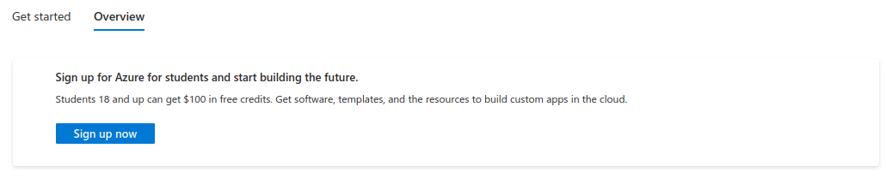
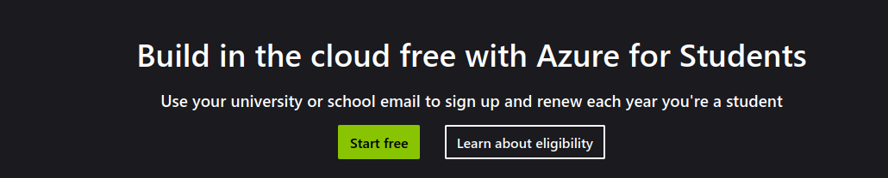

# Setup
## Azure Student Subscription (Optional)
- Go to ```https://azure.microsoft.com/en-us``` and sign in
- You should be redirected to ```https://portal.azure.com/#home```
- 
- Click the third card that says __Access student benefits__
- 
- Click on the button that says __Sign up now__
- 
- Click on the button that says __Start free__
- Fill in your details and submit
- You now should have an Azure Student Subscription
## Github Repo
- Fork the repo
# Deployment
## Requirements
- App should be available at ```yourDomain.azurestaticapps.net```
## Hints
- You should deploy via Github Repo
- Build preset should be ```React```
- Build path is ```dist```
- Most of the other settings don't matter